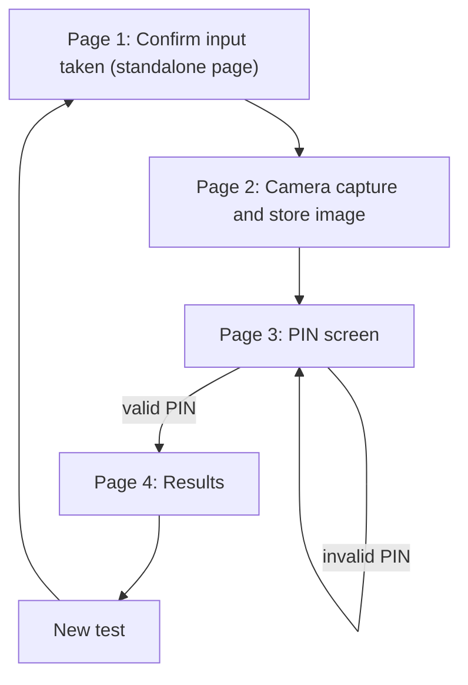

# NarcoSense: Field Operator Web App (Demo Build)
**Product Requirements Document · Draft v0.1 · 20 Sept 2026**

---

## 1. Summary

NarcoSense needs a simple operator-facing web app that walks an inspector through one screening test from start to finish:

1. Confirm that the sample input has been taken (on a **separate, standalone page**).
2. Capture and store a photo.
3. Unlock the results with a **PIN**.
4. View the result: captured image, **Legal / Illegal** status, the predicted substance (based on the captured gas pattern) and a **confidence range**.

Real narcotic samples are not available for the hackathon, so **results are hardcoded and mapped to the PIN entered**. Every value (substance, legality, percentage range, gas profile) lives in a config file so it can be changed without touching the UI code.

## 2. Goals and non-goals

**Goals**
- A clear, fast, four-step flow that works on a phone or a tablet.
- Nothing about a test (image, result, substance) is visible before PIN entry, to prevent information leaks.
- Fully scripted demo: entering a given PIN always produces the same scenario.
- All demo values are editable variables, not code (for example "Paracetamol, 65–80%").
- Architecture that lets the hardcoded result source be swapped for the real ESP32 + ML output later.

**Non-goals (this version)**
- Real drug detection or real model inference in the web app.
- Real authentication, user management or forensic chain of custody.
- Backend ML, cloud sync or multi-device support.

## 3. Users

| User | Description |
|---|---|
| Inspector / operator | Runs the test, confirms input, takes the photo, unlocks results with a PIN |
| Judge / observer | Watches the demo; must be able to tell that the results are simulated |

## 4. End-to-end flow



**Session status:** `INPUT_CONFIRMED` → `IMAGE_CAPTURED` → `UNLOCKED` → `COMPLETE`

**Route guards:** each page can only be opened if the previous step is done. Opening any other URL directly (for example `/results`) redirects to Page 1.

## 5. Screen requirements

### Page 1: Confirm input taken (standalone)

**Purpose:** the operator confirms that the sample input has been taken manually.

| ID | Requirement |
|---|---|
| P1-1 | This page is **completely separate** from the rest of the app: its own HTML file or route (for example `/confirm`), its own minimal script, no shared header, no navigation links to other screens. |
| P1-2 | It shows **no** inspector name, result, image or sensor data. |
| P1-3 | One primary button: **"Confirm: Input Sample Taken"**. The button is disabled after the first tap to prevent double submission. |
| P1-4 | On tap, create a new test session (`session_id`, timestamp, status `INPUT_CONFIRMED`) and navigate to Page 2. |
| P1-5 | The only data passed to the next page is the `session_id`. |
| P1-6 | *(Future)* the same tap can trigger the ESP32 to start its sampling cycle. |

### Page 2: Camera capture

| ID | Requirement |
|---|---|
| P2-1 | Request camera permission and show a live preview. |
| P2-2 | A **Capture** button takes the photo and shows it for review, with **Retake** and **Use this photo** options. |
| P2-3 | On **Use this photo**, store the image against the `session_id` with a timestamp and set status to `IMAGE_CAPTURED`. |
| P2-4 | Image is saved as JPEG (max width 1280 px, quality about 0.8). |
| P2-5 | Camera permission denied or unavailable: fall back to a file input that opens the device camera. |
| P2-6 | The stored image is **not shown anywhere** until the results page after PIN unlock. |

### Page 3: PIN screen

| ID | Requirement |
|---|---|
| P3-1 | Neutral screen that shows nothing about the test. Only a title ("Inspector Access") and a numeric PIN keypad. |
| P3-2 | PIN length: 4 digits (configurable). The digits are masked. |
| P3-3 | The PIN is checked against the scenario table (Section 6). A valid PIN loads that scenario and sets status to `UNLOCKED`. |
| P3-4 | An invalid PIN shows a generic "Invalid PIN" message. After 3 wrong attempts, lock the screen for 30 seconds. |

### Page 4: Results

| ID | Requirement |
|---|---|
| P4-1 | **Inspector name** is pinned at the top of the screen (taken from the PIN's scenario entry). |
| P4-2 | Show the **captured image** for this session, plus the test ID and timestamp. |
| P4-3 | Show a **Legal / Illegal** badge (green / red), driven by the `legality` field. |
| P4-4 | Show the **predicted substance** and its category (for example "Paracetamol, analgesic (OTC)"). |
| P4-5 | Show the **confidence as a range** (for example "65–80%"), built from `confidence_min` and `confidence_max`. |
| P4-6 | Show the **captured gas profile**: a small bar or list of the MQ-135, MQ-3, MQ-138 and BME680 responses, with temperature and humidity, plus a line such as "Predicted from captured gas pattern". |
| P4-7 | Show a permanent **"DEMO MODE: simulated results, not forensic"** label on the screen. |
| P4-8 | Auto-hide the results after 60 seconds of inactivity (configurable) and return to the PIN screen. |
| P4-9 | **New Test** button: clears the in-memory result and returns to Page 1. |

## 6. Demo scenarios (hardcoded, config-driven)

Each PIN maps to one scenario. All fields are variables in a single config file (`scenarios.json`).

**Schema**

```json
{
  "1234": {
    "inspector_name": "Inspector A",
    "substance": "Paracetamol",
    "category": "Analgesic / antipyretic (OTC)",
    "legality": "LEGAL",
    "confidence_min": 65,
    "confidence_max": 80,
    "gas_profile": {
      "mq135": 0.42,
      "mq3": 0.18,
      "mq138": 0.35,
      "bme680_voc": 0.51,
      "temperature_c": 27.4,
      "humidity_pct": 48
    }
  }
}
```

**Example seed data** (only PIN 1234 is fixed by requirement; the rest are placeholders to edit)

| PIN | Displayed substance | Legality | Confidence range |
|---|---|---|---|
| 1234 | Paracetamol | Legal | 65–80% |
| 2345 | Ibuprofen | Legal | 60–75% |
| 4567 | Cannabinoid-related pattern | Illegal | 55–70% |
| 5678 | Opioid-related pattern | Illegal | 60–78% |
| 6789 | Stimulant-related pattern | Illegal | 58–72% |

*Gas profile values shown in the schema are placeholders; set them per scenario so the bars look consistent with the story.*

**Result provider interface.** The results page must not read the config directly. It calls a single function, `getResult(sessionId, pin)`.
- **Now:** returns the scenario from `scenarios.json`.
- **Later:** the same function returns the real ESP32 + ML classifier output (class probabilities, confidence, inconclusive logic). No UI change is needed.

## 7. Data and storage

| Item | Detail |
|---|---|
| Session record | `session_id`, created_at, status, inspector_name (after unlock), scenario_id |
| Image | JPEG blob stored in the browser (IndexedDB) keyed by `session_id`; an optional backend upload endpoint can be added later |
| Config | `scenarios.json` bundled with the app |
| Log (nice to have) | One local log entry per test: session_id, timestamps, inspector, scenario shown |

## 8. Security and privacy (information-leak prevention)

- No result, image or substance name is rendered before PIN entry. Page 1 and Page 3 are deliberately neutral.
- Route guards block direct URL access to Pages 2 to 4.
- PIN is masked, with attempt limit and lockout (P3-4).
- Results auto-hide on inactivity (P4-8) and are cleared from memory on **New Test**.
- Captured images are treated as sensitive personal data: stored per session, shown only after unlock.
- **Limitation:** PINs in `scenarios.json` are visible to anyone who inspects the app code. This is acceptable for a scripted demo, but it is not real security.

## 9. Non-functional requirements

- Mobile-first, responsive layout (phone, tablet, laptop).
- Camera access requires **HTTPS** (or `localhost`) in browsers, so plan hosting accordingly.
- Full flow from Page 1 to results in under 60 seconds.
- Large tap targets and high-contrast Legal/Illegal badges for outdoor or field readability.
- Works with no network once loaded (static assets and local storage only).

## 10. Acceptance criteria

1. Page 1 loads on its own, with no shared UI, and only creates a session and hands off `session_id`.
2. Opening `/results`, `/pin` or `/camera` directly without completing the earlier steps redirects to Page 1.
3. A captured photo can be retaken and is stored only after **Use this photo**.
4. Before a valid PIN, no result, image or substance name is visible anywhere.
5. Entering `1234` shows: Paracetamol, **Legal**, 65–80%, the captured image and the gas profile.
6. Every other seeded PIN shows its own scenario; changing a value in `scenarios.json` (for example the 65–80% range) changes the screen with no code edit.
7. Three wrong PINs trigger the 30-second lockout.
8. The inspector name appears at the top of the results page.
9. The "DEMO MODE" label is visible on the results screen.
10. **New Test** clears the result and returns to Page 1.

## 11. Assumptions and open questions

1. **Order of steps.** The first version of the flow had PIN login before the camera; the final version had camera, then PIN and results. This PRD follows the final version. Confirm.
2. **Inspector name.** Assumed to come from the PIN's scenario entry and be shown at the top of the results after login. Alternative: a name field on the PIN screen. Confirm.
3. **Photo subject.** Assumed to be the person being tested, for the record. Alternative: a photo of the sample or mouthpiece.
4. **Image storage.** Assumed browser-local storage for the demo. Confirm whether a backend is needed.
5. **PIN length.** Assumed 4 digits.
6. **Legality labels.** Some substances are legal only with a prescription. The demo keeps the simple Legal / Illegal split; add a third "Regulated" label if needed.

## 12. Suggested build order

1. Page 1 (standalone) and session creation.
2. Camera capture, retake and image storage.
3. `scenarios.json` and `getResult()`.
4. PIN screen with lockout and route guards.
5. Results page (image, badge, range, gas profile, inspector header, DEMO label).
6. Inactivity auto-hide and New Test reset.
7. Polish, mobile testing on HTTPS, rehearse each PIN scenario.
